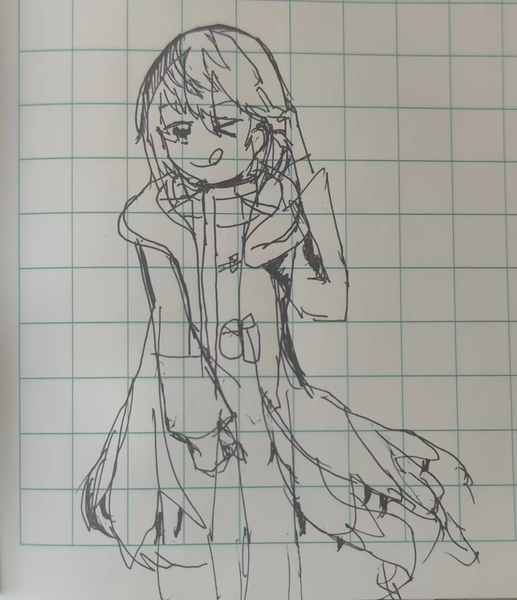

# 题目链接：https://ac.nowcoder.com/acm/contest/71300/G

本题TAG（不重要）：bfs/dfs，树形DP。

    fsj-o：
        背景，我最近看了泛式的新一期新番导视：“我要和我最喜欢的vector小姐结婚啦，究极无敌典中典开局。你这种题目，我绝对要用bfs把树的遍历写出来啊！什么？我看你是不懂我的地址随时会变化哦，还想随便用引用来干我？？啊啊啊痛痛痛，这就是C++最难debug的地方吗，我认输了认输😭。”。
    
    愁虫战记：
        BUG名: 试图对STL容器刻舟求剑
        BUG描述：在函数中留下了的关联到STL容器的引用变量，并在操作过STL容器后接着使用该引用变量，此时STL容器已经触发扩容或调整其元素位置的STL容器，引用变量访问到了内存的不正确位置，造成的是未定义行为。
        解决难度：通常在其他所有BUG都自己认为清除后，却依然无法理解代码行为时，通过插入大量的打印来意识到并解决该BUG，同时注意题目给的样例并不一定能让我找出BUG真地是存在的，它是需要流程化在我脑中，常常需要检查的一个BUG，难度等级EXTREMELY-HARD。
        解决方案：通过多数的变量打印发现有无法理解的行为时，试着突然注意到它，再思考C++黑森林般的可能运用方法和导致的后果后，简单地去掉取引用的结构化绑定方式，是最好的解决方案。、////////////////////////////////////////

# BUG已被发现的出现位置
    例1：bfs一颗无向树
        描述（代码块）：
        ```cpp
            // 已定义邻接表 vector<vector<int>> G(n); 
            // 下述代码展示从树的结点0开始进行bfs。
        
            vector<pair<int, int>> q {{0, -1}}; // bfs 队列
            for (int i = 0; i < (int)q.size(); i++) {
                auto &[v, p] = a[i]; // 引用变量（此处为从bfs队列中取队首）
                for (int u : G[v]) {
                    if (u == p) continue;
    
                    a.push_back({u, v}); // 操作STL容器（此处为将结点加入bfs队列）
                }
                // 此处for (int u : G[v]) 这个循环很可能操作不止一轮，如果循环时由于push_back，使得bfs队列发生了扩容，循环外创建的关联到bfs队列的引用变量 &[v, p] 由于bfs队列已经扩容而它们没有进行维护是危险指针，操作它们行未定义行为。
            }
        ```

        正确做法：取队首时不取引用

    例2：dijkstra堆优化
        描述：刻舟求剑BUG的另一个经典的出现位置（两年前就遇到过了），取堆顶时取引用的话，这些**引用STL的变量**无法跟随**STL的操作**而**自动更新**，随着堆内变换，它们会转化成危险的指针。
        
        正确做法： 取堆顶时不取引用

    刻舟求剑这个BUG似乎和**队列**绑定出现了，我使用std::set却从未遇到过这个BUG，我很好奇。

# 涂鸦

这个BUG和STL相关，于是想设计STL娘的形象，这是我第一次想象这个角色的样子。以下是角色的设定：

<details>
<summary>STL娘(^ <) 涂鸦日记</summary>


</details>

1. 它（STL娘）的脖子处，有可以插拔头部的地方。插拔头部象征着STL最瞩目的**模板**特性、代表了STL编译时**插入式**地生成代码式的多态。
5. 它本体其实是一只小怪兽藏在她厚实的内衬里面。
2. 它的内衬是非常厚重布料制作，非常不透气，这代表STL的高度封装。
3. 它有一件戴帽外套，分上下两部分，上半身是完好的，这代表了C++保持向后兼容所形成的外表完备可靠，底部是阑珊的，这代表了C++保持向后兼容所造成的外表也有破破烂烂。
4. 它的外套的底部内侧，贴着许多尖牙和一张完全藏住了的大嘴，这是小怪兽伸出来呼吸和捕食用的。
6. 它会很在意自己在别人眼中的印象，如果某人试图暗指着它的外套说“这不是破破烂烂吗”，小怪兽就会很生气。
4. 它在图中插上少女可爱的头和调皮的表情是让我放松禁戒用的，在它的长期可靠的伪装下，有时就突然用嘴咬了我一口，我要进ICU了。
5. 它（STL娘）角色本身是比较严肃的类型，这张调皮的**快照**才代表本页记载的在“刻舟求剑”这个BUG。


# 本题AC代码：
<details>
<summary> 👇 </summary>

```cpp
#include <bits/stdc++.h>

using namespace std;

int main() {
    ios::sync_with_stdio(0); cin.tie(0);

    int n;
    cin >> n;
    vector<vector<int>> G(n);
    for (int i = 0; i < n-1; i++) {
        int v, u;
        cin >> v >> u;
        --v; --u;
        G[v].push_back(u);
        G[u].push_back(v);
    }
    auto generatePairId = [id = 0] () mutable -> int { return id++; };
    vector<int> pairId(n, -1);
    auto dfs = [&] (auto&& self, int v, int p) -> void {
        for (int u : G[v]) {
            if (u == p) continue;
            self(self, u, v);
            if (pairId[u] == -1) {
                if (pairId[v] == -1) {
                    pairId[v] = pairId[u] = generatePairId();	
                } else {
                    cout << -1 << '\n';
                    exit(0);
                }
            }
        }
    };
    
    dfs(dfs, 0, -1);
    if (pairId[0] == -1) {
        cout << -1 << '\n';
        return 0;
    }
    
    string colors(n, '?');
    vector<pair<int, int>> q;
    q.push_back({0, -1}); // {结点编号，父亲编号} 
    colors[0] = 'R';
    for (int i = 0; i < (int)q.size(); i++) {
        auto [v, p] = q[i];  // 重要的是总是不对STL娘使用结构化绑定时取引用，它就几乎奈何不了我，它太优秀了。
        for (int u : G[v]) {
            if (u == p) continue;
            colors[u] = (pairId[v] == pairId[u] ? colors[v] : (colors[v] == 'R' ? 'B' : 'R'));
            q.push_back({u, v});
        }
    }
    
    cout << colors << '\n';
}
```
第一个dfs可以改成bfs吗，刚才觉得可以，现在觉得，应该，不能吧。

</details>
